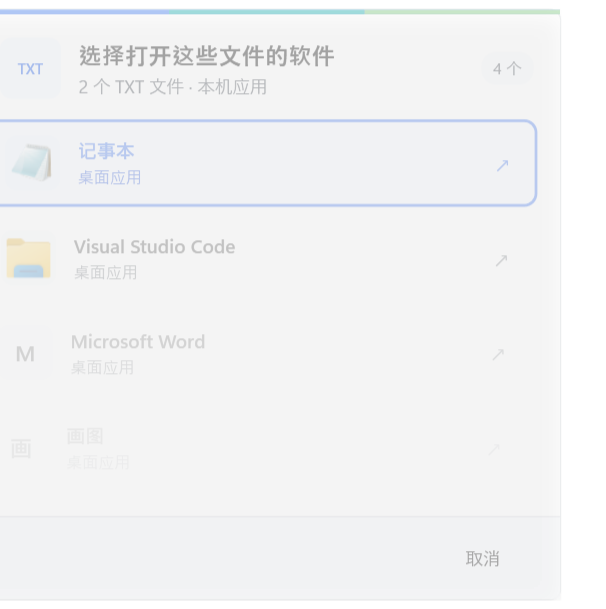
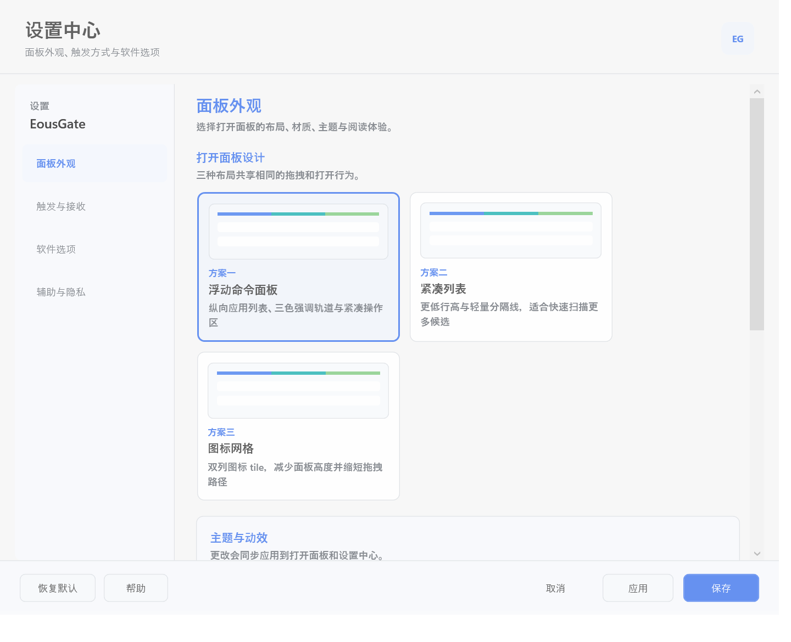

# EousGate

> Windows 11 文件拖拽打开面板。把一个或多个文件拖到屏幕边缘，快速选择本机软件打开。

EousGate is a local Windows 11 utility that lets you drag files to a screen edge and choose an installed app to open them.

当前版本：`v0.1.0-beta.2`（公开测试版）



## 功能

- 支持主屏幕左侧、右侧和上侧接收条，可任意组合
- 支持单文件和多文件；混合类型只显示能处理全部文件的软件
- 发现 Windows 桌面软件和打包应用，并支持按扩展名添加自定义 `.exe`
- 支持候选数量、顺序、隐藏、主题、材质、动效和面板参数
- 完全本地运行，不上传文件，不修改 Windows 默认文件关联
- 诊断默认关闭；开启后也不记录文件内容、文件名或完整路径



## 下载与使用

1. 打开 [EousGate v0.1.0-beta.2 Release](https://github.com/Eous-the-Bangboo/EousGate/releases/tag/v0.1.0-beta.2)。
2. 下载 `EousGate-v0.1.0-beta.2-win-x64.zip` 和对应的 `.sha256` 文件。
3. 解压 ZIP 到任意文件夹，不要直接在压缩包里运行。
4. 运行 `EousGate.exe`；程序会驻留在系统托盘。
5. 从资源管理器拖动一个或多个文件到启用的屏幕边缘。
6. 将文件继续拖到软件选项上松开，或使用键盘选择软件。

右键托盘图标可以暂停/恢复边缘唤出、打开设置或退出。EousGate 是绿色免安装软件，不需要预先安装 .NET 8 Desktop Runtime，也不会自动加入开机启动。

### Windows 安全提示

这个 Beta 版本尚未进行数字签名，因此首次下载运行时可能出现 Microsoft Defender SmartScreen 的“Windows 已保护你的电脑”提示。请只从本仓库 Release 下载，并先核对 SHA-256；只有在确认来源和校验值正确后才继续运行。

校验示例：

```powershell
Get-FileHash .\EousGate-v0.1.0-beta.2-win-x64.zip -Algorithm SHA256
Get-Content .\EousGate-v0.1.0-beta.2-win-x64.zip.sha256
```

## 系统要求与已知限制

- 支持环境：Windows 11 x64、主显示器
- 当前不支持：文件夹、多显示器边缘、自动更新、自动启动和 Windows 默认关联修改
- 已修复“照片”误打开资源管理器；本机已验证单 JPG 和 JPG+PNG，其他 Windows/Photos 版本、完整鼠标拖拽、干净 Windows 11、DPI 和高对比度仍需更多测试
- 这是 Beta 版本；重要工作前请先用非敏感文件验证目标软件的打开行为

## 隐私

EousGate 不联网、不上传文件，也不读取文件内容。软件只把用户拖入的本地文件路径交给用户选择的软件。可选诊断日志仅记录固定事件名和时间戳，默认关闭。

## 反馈问题

请通过 [GitHub Issues](https://github.com/Eous-the-Bangboo/EousGate/issues) 报告问题或建议。提交问题时不要粘贴私人文件名、完整路径或文件内容。

## 从源码构建

需要 Windows、.NET 8 SDK 和 PowerShell：

```powershell
dotnet build EousGate.csproj --configuration Release
.\Tests\run-tests.ps1 -Configuration Release
.\publish.ps1
```

发布脚本会运行 Release 测试，生成 Windows 11 x64 自包含目录、版本化 ZIP 和 SHA-256 校验文件。开发与验收资料入口见 [docs/DEVELOPMENT-INDEX.md](docs/DEVELOPMENT-INDEX.md)。

## 许可证

EousGate 使用 [MIT License](LICENSE)。
